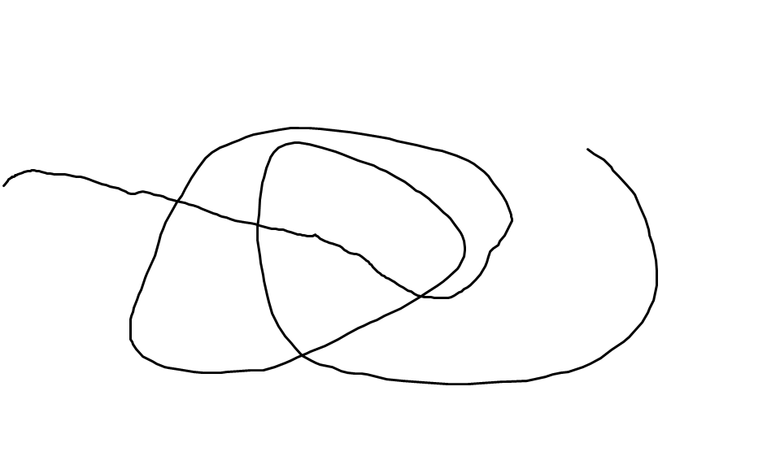
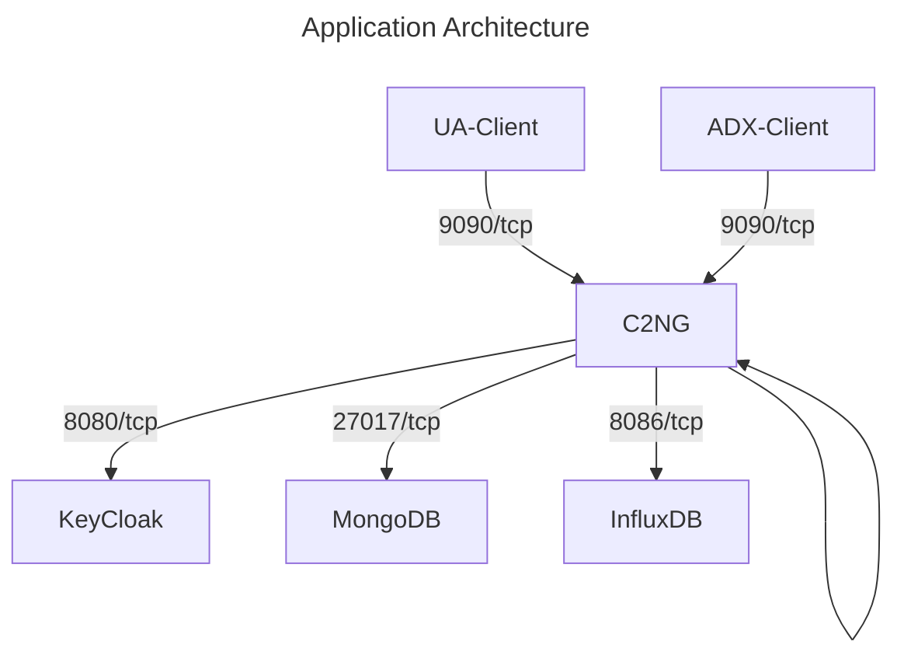

# System Administration Tasks

## Configuration

### Environment Variables

These environment variable are used to configure third-party containers and set secret values. All other configuration parameters for the service are set up via the [YAML configuration file](#configuration-file).

#### KeyCloak OAuth Service Configuration

* `KEYCLOAK_ADMIN` sets an admin username on container creation
* `KEYCLOAK_ADMIN_PASSWORD` sets an admin password (keep strictly secret for production deployments)

#### MongoDB Service Configuration

* `MONGO_INITDB_ROOT_USERNAME` sets a username for MongoDB
* `MONGO_INITDB_ROOT_PASSWORD` sets a password for MongoDB

#### MongoExpress Configuration

* `ME_CONFIG_MONGODB_ADMINUSERNAME` sets a username
* `ME_CONFIG_MONGODB_ADMINPASSWORD` sets a password
* `ME_CONFIG_MONGODB_URL` access URL for MongoDB

#### Core Service Configuration

* `C2NG_UAS_CLIENT_SECRET` client secret for UA and ADX users authentication
* `C2NG_USS_CLIENT_SECRET` client secret for service to service authentication for USS simulator service (`c2ng` to `uss`)
* `C2NG_UA_DEFAULT_PASSWORD` a default password for a simulated user

### Configuration File

#### `service` Section

This section configures access to the services itself.

Parameters:

* `port` is a TCP port for service to listen to incoming HTTP requests.

#### `logging` Section

This section configure the logging facility.

Parameters:

* `verbose` controls whether the logging mechanism shall be more verbose. If `true`, the level is set to `DEBUG`, otherwise to `INFO`.

#### `oath` Section

This section controls what OIDC server to user to authenticate users again. This version can only contain a single subsection called `keycloak`, with the following parameters:

* `base` is the base URL of the server.
* `realm` is the KeyCloak's realm that contains the enrolled UAV as users.

#### `uss` Section

This section configures how the service reaches the USSP flight authorization endpoint or a simulator:

* `endpoint` set a URL of the authorization server.
* `oauth` subsection contain authentication and authorization information. This version suport KeyCloak authentication server, under `keycloak` subsection.

KeyCloak authentication parameters:

* `base` is the base URL server. Note that it does not have to be identical to the [own](#oath-section) server.
* `realm` is the Keycloak realm to authenticate against.
* `auth-client-id` is a the value used as a client identifier in the Client Credentials Grant flow.

#### `mongo` Section

This section controls  inteface with MongoDB server:

Parameters:

* `uri` is a base URI of the server.

#### `nsacf` Section

This section controls interface with NSACF in the Network Core.

Parameters:

* `simulated` is set to `true` for simulations with an internal NSACF simulator.
* `uri` is a base URL of the Function.

#### `security` Section

This section controls link security and encryption mechanism.

Parameters:

* `certificate` set the path to a file with the root X.509 certificate of the service in the PEM format.
* `private` set the path to a file with the root private key in the PEM format.
* `defaul-ttl` set the Time-to-Live parameter of the core certificate.

## Enrollment

__TBD__

## Makefile

### Image Generation

__TBD__

### Cryptograhic Keys Generation

__TBD__

### OpenAPI Specification Regenerating

To extract OpenAPI 3 service specification from code, run:

```sh
make generate
```



## Running Simulation

### Simulation Deployment



__TBD__