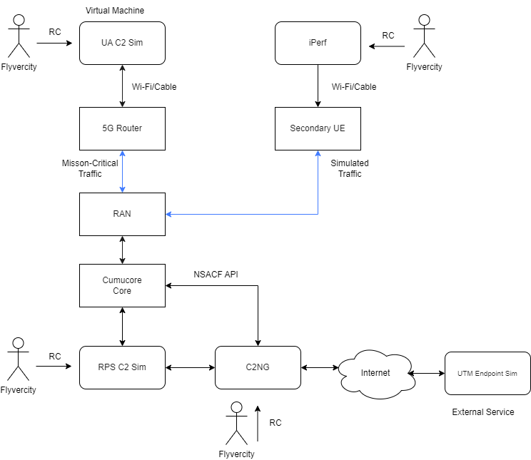
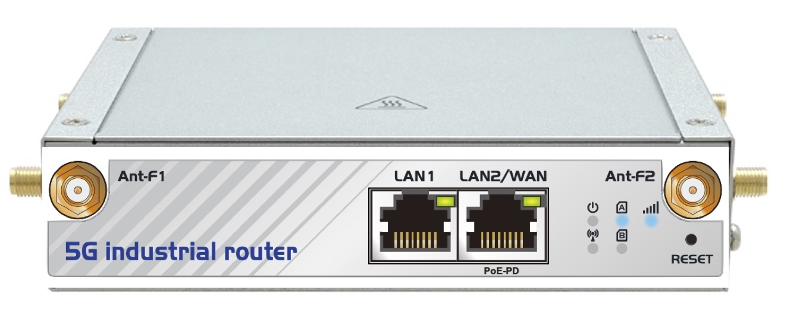
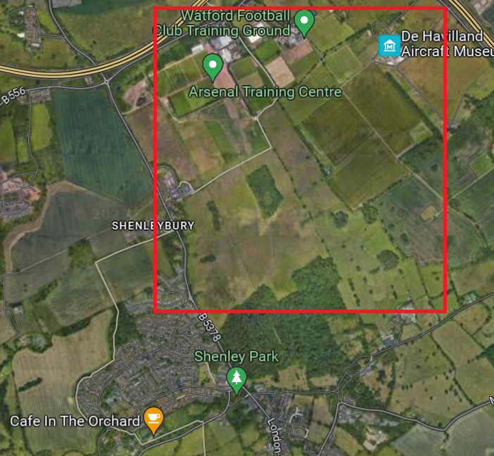
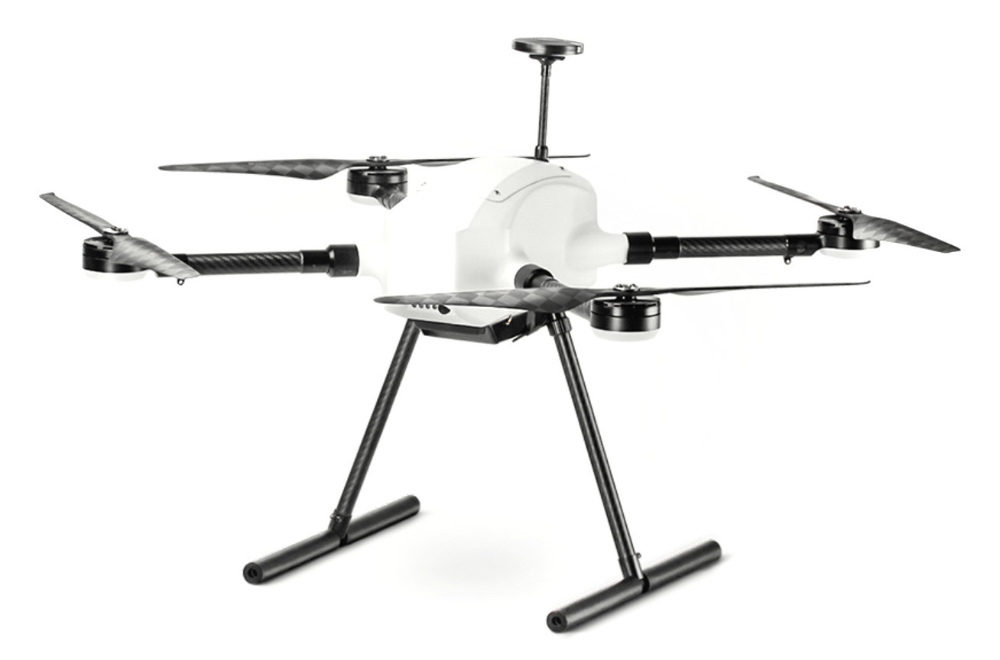
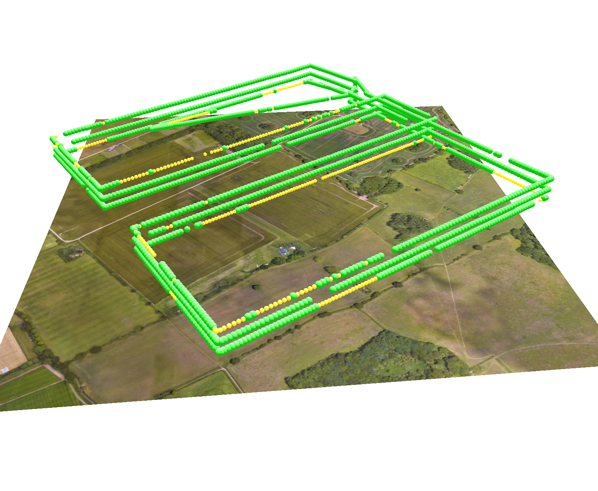

# IV. Experiments Description

## Laboratory Experiment

Lab experiment is set up in cooperation with Cumucore Oy.



### Experiment components

* UA C2 Sim - A container to run an airborne command-and-control (C2) function simulator. A simulator is a part of the C2NG CLI tools suite. This software connects to C2NG and RPS C2 Sim software components (C2NG and RPS C2) are installed in a single server connected to the 5G Core and transmits simulated ‘safety-critical’ traffic.
* 5G Router - A UE that connects the RAN. Also connects to UA C2 Sim. Model used: __TeleWell 5G industrial router__.
* Bridge Application is used to communicate with the built-in modem inside the 5G Router.



* RAN - Cumucores 5G laboratory base station.
* Cumucore Core is a core that provides both generic connectivity (amongst UA C2 Sim, C2NG, and RPS C2 Sim components).
* C2NG - a docker containter that runs the core service.
* RPS C2 Sim -  A simulator is another small piece of software developed by Flyvercity. 

## Flight Experiment

Flight experiment is set up in cooperation with Sky-Drones Technologies Ltd.

### Flight Experiment Zone

Experimental flight localtion: Hemel Hempstead Model Flying Club, Rectory Ln, Shenley, Radlett WD7 9AW, United Kingdom.



### Flight Experiment Equipment

* Sky-Drones X700 Platform
* Integrated Telit FN980 Modem
* 5G Frequency Range 1 Antenna Kit
* Sky-Drones ATLAS Remote Control
* Sky-Drones SMARTLINK on-board computational module
  * Flyvecity UA Sim Software Component



### Data Acquisition

A list of parameters to be captured:

* Reference Time (Unix Epoch)
* Aircraft Latitude and Longitude
* Aircraft Geodesic Altitude
* Aircraft Roll, Pitch, and Yaw
* Aircraft North and East Velocity
* Aircraft True Heading
* Aircraft Downward Velocity
* Aircraft Air Speed
* Heartbeat loss flag on,
* Heartbeat loss flag on RPS
* Aircraft Barometric Altitude
* Round-trip time (RTT)
* Aircraft Serving physical cell identifier
* Aircraft Serving Frequency Band Identification
* Aircraft Serving RSRP, RSRQ, RSSI, SINR

Acquisition format: local JSON record files. Refer to CUE [specification](https://github.com/flyvercity/dataengine/blob/main/fvcf.cue).


### Flight Experiment Results

#### Raw Data Sample (2023-08-15)

```json
{"timestamp": {"unix": 1692125286.592828}, "position": {"location": {"lat": 51.7027428, "lon": -0.2682453, "alt": 125.674}, "attitude": {"roll": -0.011166839860379696, "pitch": 0.0075567238964140415, "yaw": 2.0088229179382324}}, "signal": {"radio": "5GNSA", "RSRP": -93, "RSRQ": -11}}

{"timestamp": {"unix": 1692125287.594658}, "position": {"location": {"lat": 51.7027429, "lon": -0.2682453, "alt": 125.686}, "attitude": {"roll": -0.01098616886883974, "pitch": 0.007935342378914356, "yaw": 2.009046792984009}}, "signal": {"radio": "5GNSA", "RSRP": -93, "RSRQ": -11}}

{"timestamp": {"unix": 1692125288.595598}, "position": {"location": {"lat": 51.7027429, "lon": -0.2682456, "alt": 125.703}, "attitude": {"roll": -0.010614585131406784, "pitch": 0.007171763107180595, "yaw": 2.009789228439331}}, "signal": {"radio": "5GNSA", "RSRP": -93, "RSRQ": -12}}

{"timestamp": {"unix": 1692125289.596702}, "position": {"location": {"lat": 51.7027433, "lon": -0.2682459, "alt": 125.809}, "attitude": {"roll": -0.010071463882923126, "pitch": 0.008770615793764591, "yaw": 2.010474681854248}}, "signal": {"radio": "4G", "RSRP": -93, "RSRQ": -12}}
```

#### Captured Signal 3D Plot

The rendering below show a 3D graph of the RSRP values captured during two validation flights, combined. Color coding is as follows:

* excellent: -80 dBm or greater;
* good: -80 to -90 dBm;
* fair: -90 to -100 dBm;
* poor: -100 to -120 dBm.




#### Flight Stats

Test flight #1:

* duration: 2300 seconds
* minimum altitude: 123 meters
* maximum altitude: 157 meters
* average altitude: 141 meters
* minimum RSRP: -108 dBm
* maximum RSRP: -74 dBm
* average RSRP: -92 dBm
* minimum RSRQ: -20 dB
* maximum RSRQ: -9 dB
* average RSRQ: -13 dB


Test flight #2:

* duration: 1628 seconds
* minimum altitude: 125 meters
* maximum altitude: 228 meters
* average altitude: 197 meters
* minimum RSRP: -110 dBm
* maximum RSRP: -70 dBm
* average RSRP: -81 dBm
* minimum RSRQ: -20 dB
* maximum RSRQ: -7 dB
* average RSRQ: -15 dB
