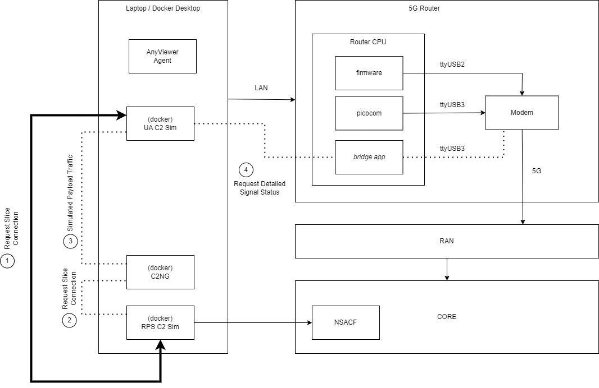

# IV. Experiments Description

## Laboratory Experiment

Lab experiment is set up in cooperation with Cumucore Oy.

### Experiment components

* UA C2 Sim - A device capable to run an airborne command-and-control (C2) function simulator. A simulator is a part of the C2NG CLI tools suite. Highly preferable for this machine is the presence of precise synchronization means (e.g., PNTP server accessible). This software connects to C2NG and RPS C2 Sim software components (C2NG and RPS C2) are installed in a single server connected to the 5G Core and transmits simulated ‘safety-critical’ traffic.
* 5G Router - A UE that connects the RAN (assumed to be a 5G router). Also requires a connection to UA C2 Sim. Model used: __TeleWell 5G industrial router__.

* RAN - Cumucores 5G laboratory base station.
* Cumucore Core is a core that provides both generic connectivity (amongst UA C2 Sim, C2NG, and RPS C2 Sim components).
* C2NG - a server, virtual machine, or containerized environment capable of running core service.
* RPS C2 Sim - A Software process running in C2NG server device or a virtual m capable to run an airborne command-and-control (C2) function simulator. A simulator is another small piece of software developed by Flyvercity. Synchronization required.
* iPerf - a device and software capable of saturating the network to validate slicing performance.
* UTM Endpoint Sim - an external web-service endpoint reachable via the public Internet.
* Secondary UE - via this UE the iPerf transmits simulated traffic. Alternatively (and preferably), simulated traffic shall go through the 5G Router simultaneously with ‘mission-critical’ traffic.

### Requirements

* UA C2 Sim & RPS C2 Sim: single Python program (standalone or containerized) capable of handling generated traffic (needs 1-2 Gb of storage).
* C2NG: software service comprises several (4) containerized applications (2 CPUs, 4 Gb RAM shall suffice), and about 3 Gb of storage for data collection.
* ‘Mission-critical’ traffic: less than 100kb/s, simulated traffic - enough to saturate the network/base station.
* Latency for ‘mission-critical’ slice lower than 100 ms (taking into account any handover-inflicted delays, if handover can be simulated in a lab environment).

## Flight Experiment

Flight experiment is set up in cooperation with Sky-Drones Technologies Ltd.

### Flight Experiment Zone

Experimental flight localtion: Hemel Hempstead Model Flying Club, Rectory Ln, Shenley, Radlett WD7 9AW, United Kingdom.

### Flight Experiment Equipment

* Sky-Drones X700 Platform
* Integrated Telit FN980 Modem
* 5G Frequency Range 1 Antenna Kit
* Sky-Drones ATLAS Remote Control
* Sky-Drones SMARTLINK on-board computational module
  * Flyvecity UA Sim Software Component

### Data Acquisition

A list of parameters to be captured:

* Reference Time (Unix Epoch)
* Aircraft Latitude and Longitude
* Aircraft Geodesic Altitude
* Aircraft Roll, Pitch, and Yaw
* Aircraft North and East Velocity
* Aircraft True Heading
* Aircraft Downward Velocity
* Aircraft Air Speed
* Heartbeat loss flag on,
* Heartbeat loss flag on RPS
* Aircraft Barometric Altitude
* Round-trip time (RTT)
* Aircraft Serving physical cell identifier
* Aircraft Serving Frequency Band Identification
* Aircraft Serving RSRP, RSRQ, RSSI, SINR

Acquisition format: local CSV files.
