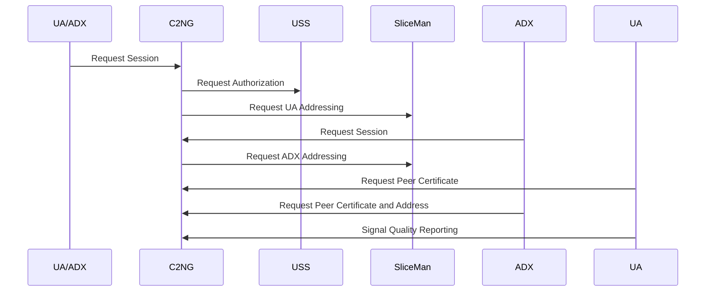
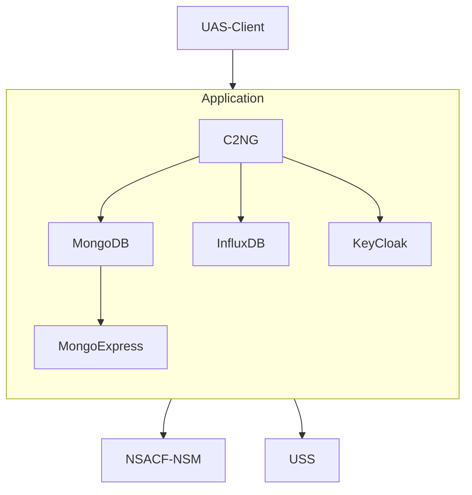
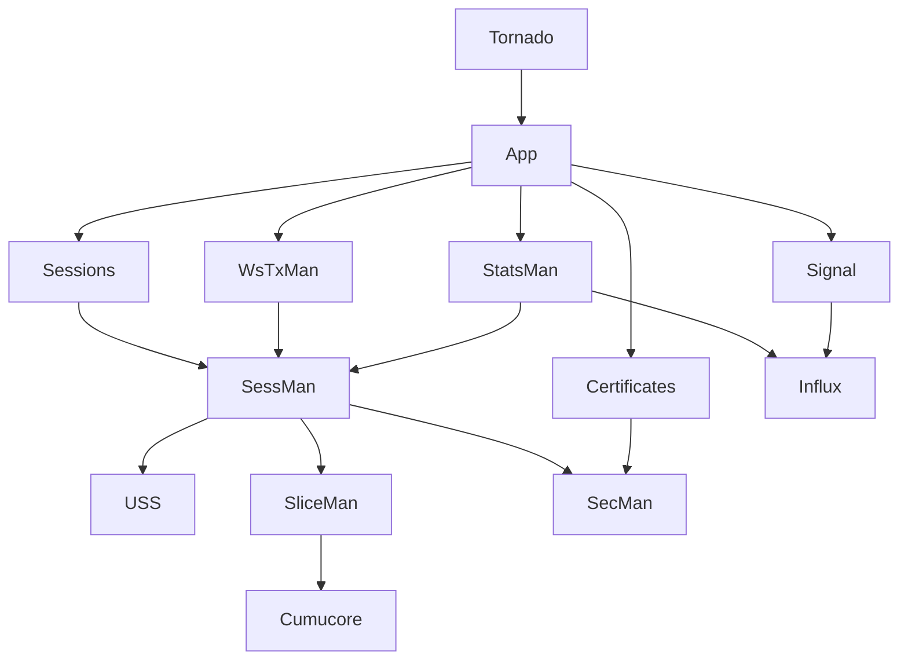
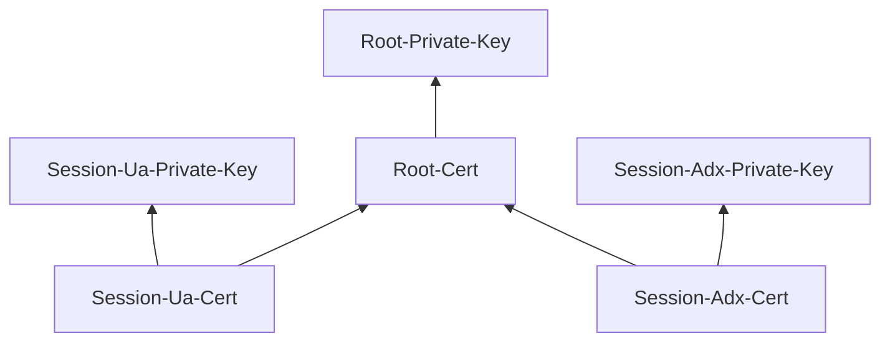
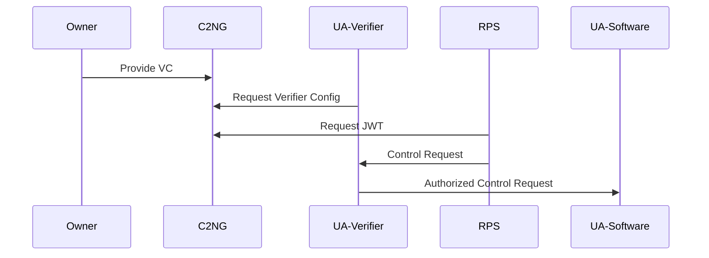
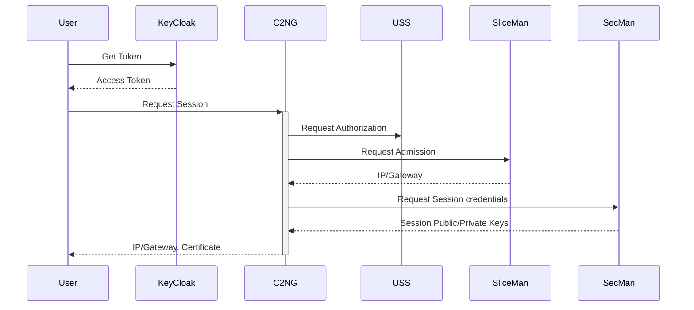
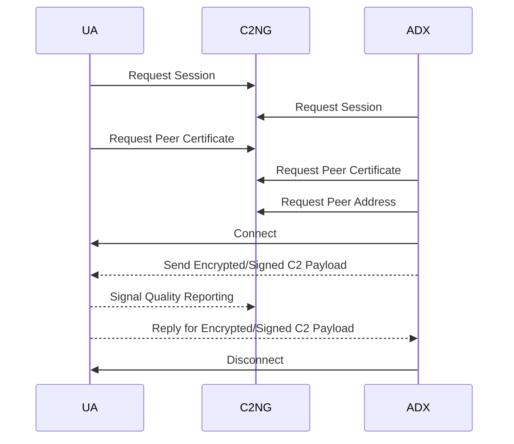
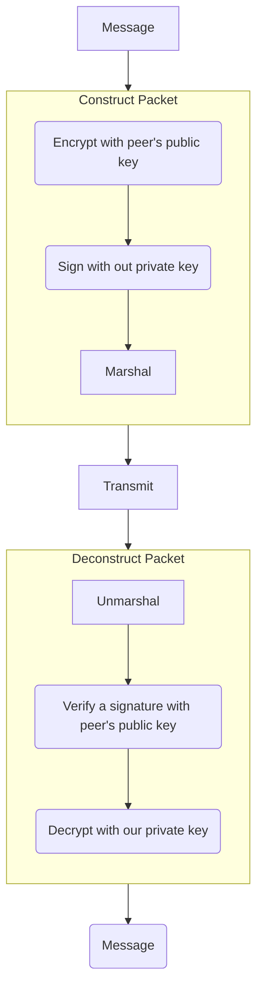

# I. General System Description

___Project: C2NG Trusted Uncrewed Aviation Systems  
Command and Control for IoT-NGIN Open Call 2.___

## Disclaimer

IoT UAS C2 is a sub-project funded via the [IoT-NGIN project](https://iot-ngin.eu) Open Call. IoT-NGIN has received funding from the European Union’s Horizon 2020 research and innovation programme (Grant Agreement No 957246).

## Introducion

When uncrewed air vehicle (UAV) command-and-control (C2) connectivity employs a cellular network, specifically for BVLOS (Beyond Visual Line-of-Sight), there is a number of considerations for an operator to resolve. These issues are driven by the Use Case itself, but also by existing standardization and regulation.

The problems to be addressed relate to the different aspects: deployment, performance, safety, and security. The Use Case calls just for a proper IP-based data exchange, but establishing it properly can be challenging.

The trusted UAS Next-Generation Command-and-Control (C2NG) Service enables reliable and compliant connectivity between uncrewed aircraft (UA) a.k.a. drones and remote pilot stations (RPS). Any UA under consideration is assumed to be equipped with 5G modules and antennae. RPS may also use 5G connectivity, but not necessarily. All data exchanges are assumed to be based on TCP/IP protocol suite. In contrast with generic Internet connectivity, a reliable connection between the vehicle and the RPS is herein referred to as the “aerial connection”.

This service has three primary functions:

* manage reliability of connection by interacting with 5G network functions.
* support security by managing security credentials and implementing Aerial Connection Authorization with Uncrewed Traffic Management Systems.
* monitor performance and compliance by signal data acquisition and analysis.

There are two types of users of the service:

* Aerial Connection Users are flying objects equipped with 5G UE and requiring to establish a reliable connection. Generally these are Aerial Vehicles a.k.a. drones. These also may include Wireless RPS (remote pilot stations) a.k.a. GCS (ground control stations).
* ADX Users are stationary entities that connect to aerial users via the Aviation Data Exchange Network. These are generally fixed ground control center workstations.

Besides that, the service supports RPS to UA authorization based on the ExcID's Verifiable Credentials mechanism (see. [here](https://gitlab.com/h2020-iot-ngin/enhancing_iot_cybersecurity_and_data_privacy/privacy-preserving-self-sovereign-identities)). The service also can serve as an "issuer" of credentials.

## Primary Interactions



## Application Architecture

The Application is based on containerized services and comprises three open source basic components (KeyCloak, MongoDB, and InfluxDB) and the core software service (C2NG). Besides the core software, CLI tools was developed to control all administrative task, simulation and demostration.

KeyCloak is an open source implementation OIDC protocol and supports authorized calls to the service.

NSACF is a Network Function exposed by the 5G Core to control which users are authorized to use a slide, and hence enjoy high-reliablity allocated to it. It can be also extended by a particular implementation to control 5G slices in a more fine-grained manner (umbrella term is "Network Slice Management" - NSM).

MongoDB is a NoSQL database that serves as a persistence layer. The database is schema-less, but a logic schema is described is the corresponding [section](#mongodb-logical-schema).

InfluxDB is a timeseries database used to collect signal characteristics reported by aerial users.

C2NG designates the service itself. C2NG is a web service and exposes two APIs. The REST API described in the [API Definition](#api-definition) section is used by the users to request connectivity sessions and report signal quality information. The second API is is any web-socket based asynchronious API used to notify the users about the changes in the session status in real time. It is defined in the [Websocket API](#websocket-api) section.

The following diagram presents a schematic view of the C2NG application architecture.



The whole application is a set of Docker containers defined by the Docker Compose Specification [docker-compose.yaml](../docker-compose.yaml) for developement and single-node environments.

## Repository Structure

The primary repository is open and resides on GitHub: <https://github.com/flyvercity/iot-ngin-c2ng>. It contain the following main components:

* `c2ng` directory contains the source code:
  * `common` directory contains common code used by the service and CLI tools;
  * `service` directory contains the code of the service itself;
  * `tools` directory contains the code of CLI tools;
  * `uas_sim` directory contains the code of the UA and RPS simulators;
  * `uss_sim` directory contains the code of the USS simulator;
* `docker` directory contains Docker and configuration files:
  * `core` directory contains a Docker image definition of the core service.
    * `docker-compose.yaml` is a Docker Compose file for development environment (core service and the USS simulator).
  * `uas_sim` directory contains a Docker image definition of the UA and RPS simulators.
    * `docker-compose.yaml` is a Docker Compose file for development environment (UA and RPS simulators).
  * `uss_sim` directory contains a Docker image definition of the USS simulator.
* `docs` directory contains present documentation.
* `integration` directory contains submodules:
  * `airlink_capture` directory contains the code of the AirLink Capture tool used for data aquisition during the flight trials.
  * `ppssi` directory contains the code of the Privacy-Preserving Self-Sovereign Identities (PPSSI) tool suite forked from the [original ExcID repository](https://gitlab.com/h2020-iot-ngin/enhancing_iot_cybersecurity_and_data_privacy/privacy-preserving-self-sovereign-identities) on IoT-NGIN GitLab.
* `scripts` directory contains Bash scripts used for development and testing.
* `test` directory contains test code.

# API Definition

The short description 

* `/session` - request a connectivity session for all users.
* `/certificate/(segment)/(uas_id)` - request a certificate for a user.
* `/address/(segment)/(uas_id)` - request an IP address for a user.
* `/signal/(uas_id)` - an endpoint where the UA users report signal telemetry.
* `/notifications/auth/(segment)/(uas_id)` - an endpoint to pre-authenticate websocket connections.
* `/notifications/websocket` - a websocket endpoint to receive notifications about the session status changes.
* `/did/jwt/(uas_id)` - an endpoint to request a DID JWT token with a Verifiable Credential.
* `/did/config/(uas_id)` - an endpoint to request a verifier configuration.
* `/gui/dashboard` - render a dashboard page.

OpenAPI v.3 defition files contains an exhaustive description of the API see [Part V. API Reference](./c2ng.yaml) (generated from [`c2ng.yaml`](./c2ng.yaml)). This information is extracted from Marshmellow definitions in a special [module `schemas`](../service/schemas.py).

# Websocket API

* --> `subscribe` - subscribe to the session status updates.
* --> `unsubscribe` - unsubscribe from the session status updates.
* <-- `subscribed` - comfirmation of subscription.
* <-- `notification` - a notification about the session status change:
  * `signal-ok` - notify that the cellular signal is back to normal.
  * `signal-abnormal` - notify that the cellular signal is not usable.
  * `signal-degraded` - notify that the cellular signal is degraded.
  * `request-own-session` - notify that the user shall re-request its own session.
  * `peer-address-changed` - notify that the peer's address has changed.
  * `peer-credentials-changed` - notify that the peer's security scredentials were changed.

## C2NG Service Architecture

The C2NG service is implemented in Python (tested with Python 3.9) as a standalone Web Service based on Tornado framework. The service has modular architecture and separates core logic from external interfaces. The implementation is largely object-oriented. Web frontend follows the guidelines of the framework. 

The following diagram present a schematic view of the C2NG service architecture.



The are two layers in the application:

* user-facing interfaces comprise `Sessions`, `Certificates`, `Signal` request handlers. `WsTxMan` is a websocket manager that handles websocket connections and distributes notifications. `StatsMan` is a manager of signal statistics. 
* "backbone" service interfaces comprises `USS`, `SliceMan`, `Mongo`, and `Influx` class. Besides that, this layer also contain the Security Manager `SecMan` component responsible to manage session security credentials.
* The `SliceMan` also has a lower-level interface, for example to the Cumucore Network Configuration service.

Main service dependencies are:

* `marshmallow` - a data serialization library for handling user interactions and API generation.
* `tornado` - a webs service framework.
* `pymongo` - an interface with MongoDB.
* `cryptography` - a set of cryptographic primitives for key generating, signing, and encryption.
* `python-jose` - a set of functions work with JWT tokens.
* `python-keycloak` - an interface to KeyCloak.
* `influxdb-client-python` - an interface to InfluxDB.
* `jwcrypto`, `jsonpath-ng`, and `base58` are PSPSSI dependencies.

## Security Credentials

The service uses a hierarchy of security credentials that links session public keys of the users with the root private key of the service itself, enabling a chain of validation. The keys relate to each other is depicted by the following diagram:



The root private key and certificate are generated during the deployment and configuration process, session keys are generated every time what a new reliable connectivity session is requested by a user.

## Decentralized Authorization Procedure




### Remote Pilot Station Verifiable Credential Template

```json
{
  "@context": [
    "https://www.w3.org/2018/credentials/v1",
	"https://mm.aueb.gr/contexts/capabilities/v1"
  ],
  
  "id": "https://iot-ngin.eu/",
  "type": ["VerifiableCredential"],

  "credentialSubject": {
  	"capabilities": {
	  "sim-drone-id": ["CONTROL"]
  	}
  }
}
```

This VC at this version uses a single capability `CONTROL`, allowing a UA simulator to emulate access check. 

For details refer to the [original description](https://gitlab.com/scartill/ppssi/-/blob/main/README.md).

#### Session Establishment

The main use case of the service is the Session Establishment procedure reflected on the following diagram:



Session Establishment involves three main interfaces: with USSP to check flight authorization, SliceMan to admit the users in a slice; and internal Security Manager (`SenMan`) to generate, store, and distribute session security credentials.

#### Expected User Interaction

The following diagram reflect a typical procedure of mutual UA and ADX user login, security credentials exchange, and communications procedure.



#### Expected Encryption Procedure

While information exchange itself is a function of users and it does not involve the service itself, the logic of the applications calls user for a sequence of actions as depicted on the following diagram:



The `Transmit` action of the diagram assumes that the data are transmitter using network credentials assigned to a user.

# MongoDB Logical Schema

The service uses a single MongoDB with potentially multiple collections. Database name is `c2ng`.

## Session Collection

This is a primary collection where the service stores the current status of the slice-bounded connectivity session together with security credentials.

Name: `c2session`  
Key: `UasID`

Document schema:  
```json
{
    "UasID": "string",
    "UaID": "string",

    "UA": {
        "IP": "string: IPv4 or IPv6 address",
        "GatewayIP": "string: IPv4 or IPv6 address",
        "Certificate": "string: PEM",
        "KID" : "string: UUID",
    },

    "ADX": {
        "IP": "string: IPv4 or IPv6 address",
        "GatewayIP": "string: IPv4 or IPv6 address",
        "Certificate": "string: PEM",
        "KID" : "string: UUID"
    }
}
```

# InfluxDB Logical Schema

The service uses a single InfluxDB with potentially multiple bucket. Database name is `aerial-data`.

## `cell-signal` Collection

This is a primary collection where the service stores the 4G/5G signal statistics.

Measurement tags:

```
UasID String
Radio String
Cell String
FrequencyBand String
```
Measurement fields:

```
Latitude Float
Longitude Float
Altitude Float
Roll Float
Pitch Float
Yaw Float
VNorth Float
VEast Float
VDown Float
VAir Float
Baro Float
Heading Float
RSRP Float
RSRP Integer
RSRQ Integer
RSSI Integer
SINR Integer
Heartbeat Boolean
RTT Integer
```
