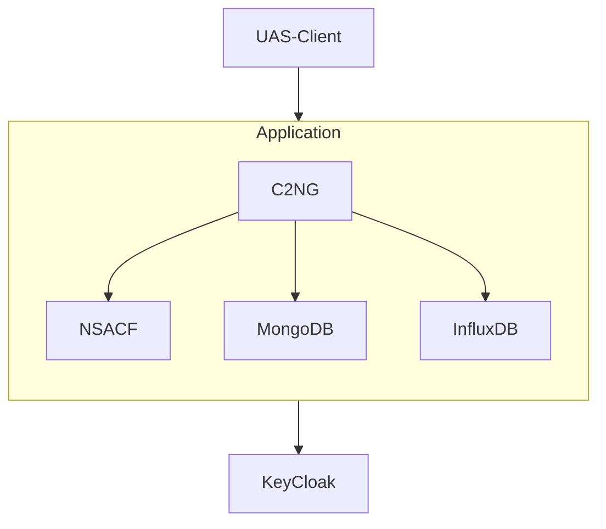
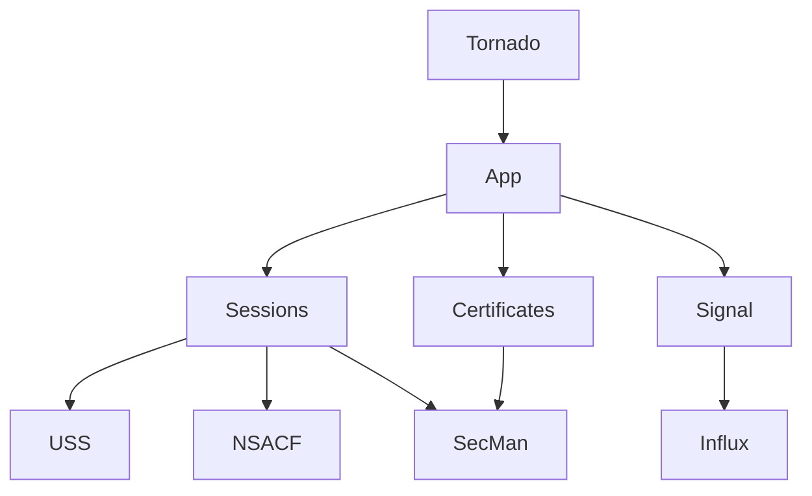
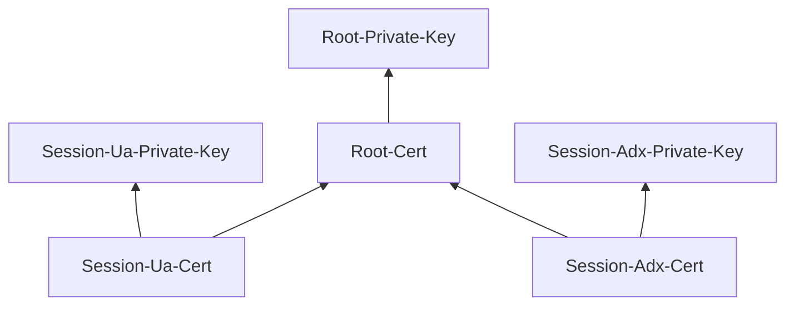
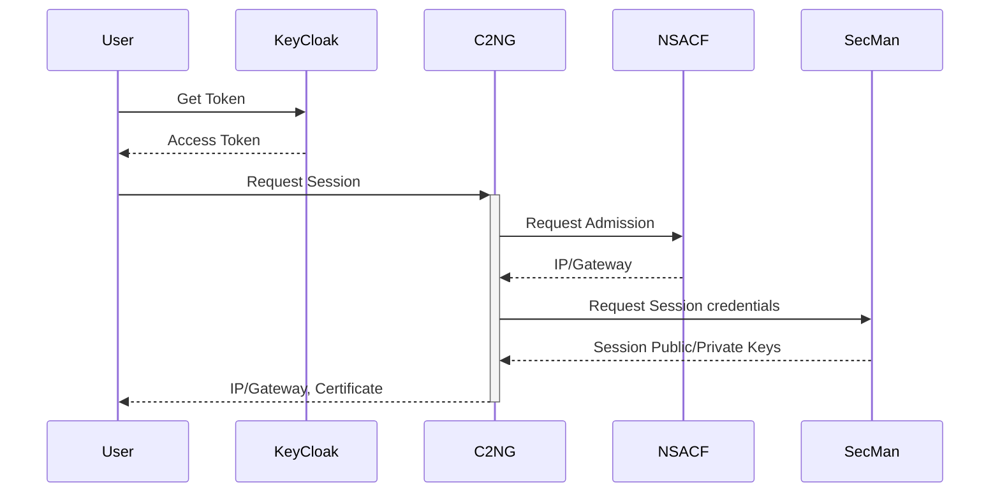
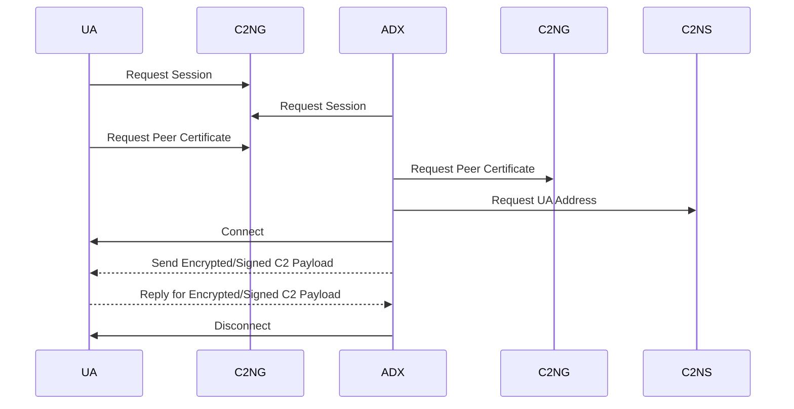
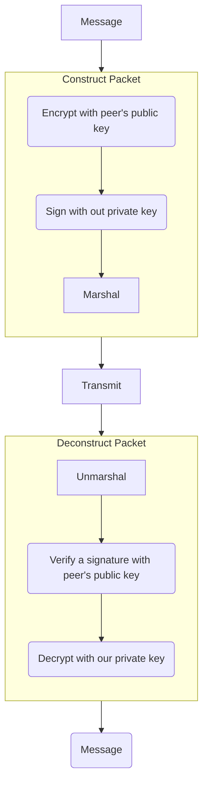
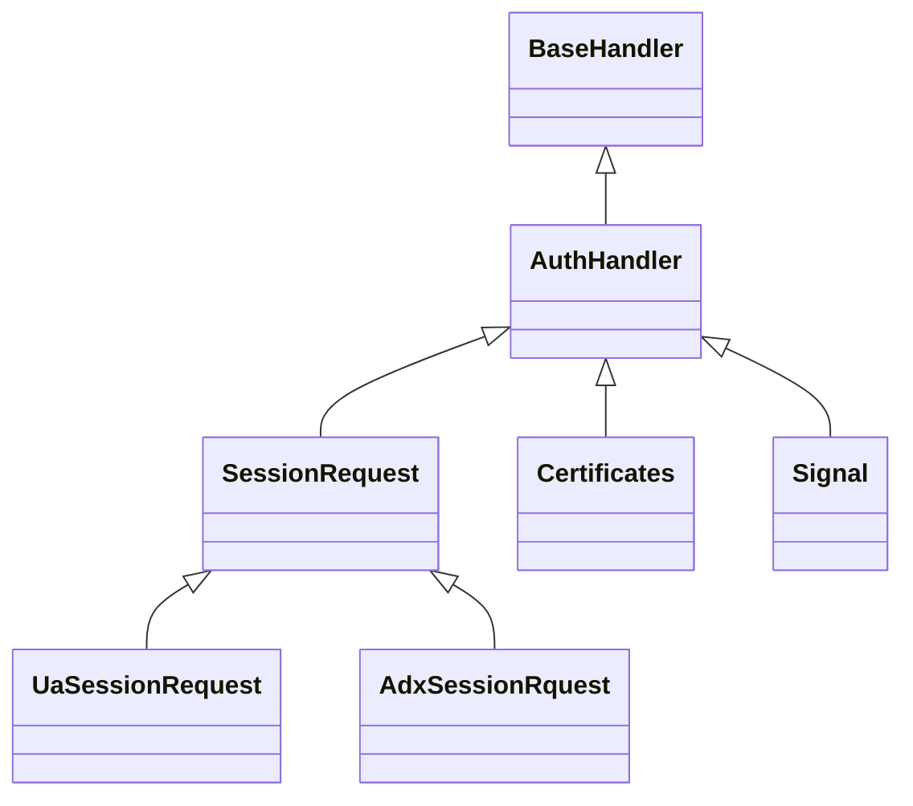
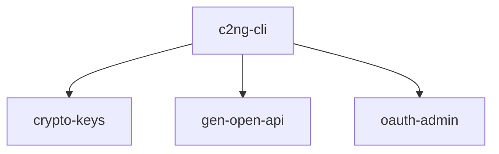

# I. General System Description

___Project: C2NG Trusted Uncrewed Aviation Systems  
Command and Control for IoT-NGIN Open Call 2.___

## Disclaimer

IoT UAS C2 is a sub-project funded via the [IoT-NGIN project](https://iot-ngin.eu) Open Call. IoT-NGIN has received funding from the European Union’s Horizon 2020 research and innovation programme (Grant Agreement No 957246).

## Introducion

The trusted UAS Next-Generation Command-and-Control (C2NG) Service enables reliable and compliant connectivity between uncrewed aircraft (UA) a.k.a. drones and remote pilot stations (RPS). Any UA under consideration is assumed to be equipped with 5G modules and antennae. RPS may also use 5G connectivity, but not necessarily. All data exchanges are assumed to be based on TCP/IP protocol suite. In contrast with generic Internet connectivity, a reliable connection between the vehicle and the RPS is herein referred to as the “aerial connection”.

This service has three primary functions:

* manage reliability of connection by interacting with 5G network functions.
* support security by managing security credentials and implementing Aerial Connection Authorization with Uncrewed Traffic Management Systems.
* monitor performance and compliance by signal data acquisition and analysis.

There are two types of users of the service:

* Aerial Connection Users are flying objects equipped with 5G UE

## Application Architecture

The Application is based on containerized services and comprises three open source basic components (KeyCloak, MongoDB, and InfluxDB) and the core software service (C2NG). Besides the core software, a CLI tool was developed to control all administrative task, simulation and demostration.

KeyCloak is an open source implementation OIDC protocol and



__TDB__

## Repository Structure

__TDB__

# API Definition

__TBD__

## C2NG Service Architecture



__TDB__

## Security Credentials



### Security Credentials Exchange Procedure

User = UA | ADX



__TDB__

### Expected User Interaction



### Expected Encryption Description Procedure



### Handlers Structure



__TDB__

## CLI Tools



__TDB__


## Logging

__TDB__

# MongoDB Logical Schema

__TDB__

Databse name: `c2ng`

## Session Collection

Name: `c2session`  
Key: `UasID`  

Document schema:  
```json
{
    "UasID": "string",
    "UaID": "string",

    "UaIP": "string: IPv4 or IPv6 address",
    "UaGatewayIP": "string: IPv4 or IPv6 address",
    "UaCertificate": "string: PEM",

    "AdxIP": "string: IPv4 or IPv6 address",
    "AdxGatewayIP": "string: IPv4 or IPv6 address",
    "AdxCertificate": "string: PEM"
}
```
