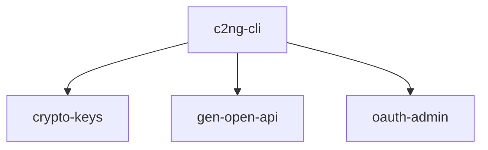

# I. General System Description

___Project: C2NG Trusted Uncrewed Aviation Systems  
Command and Control for IoT-NGIN Open Call 2.___

## Disclaimer

IoT UAS C2 is a sub-project funded via the [IoT-NGIN project](https://iot-ngin.eu) Open Call. IoT-NGIN has received funding from the European Union’s Horizon 2020 research and innovation programme (Grant Agreement No 957246).

## Introducion

When uncrewed air vehicle (UAV) command-and-control (C2) connectivity employs a cellular network, specifically for BVLOS (Beyond Visual Line-of-Sight), there is a number of considerations for an operator to resolve. These issues are driven by the Use Case itself, but also by existing standardization and regulation.

The problems to be addressed relate to the different aspects: deployment, performance, safety, and security. The Use Case calls just for a proper IP-based data exchange, but establishing it properly can be challenging.

The trusted UAS Next-Generation Command-and-Control (C2NG) Service enables reliable and compliant connectivity between uncrewed aircraft (UA) a.k.a. drones and remote pilot stations (RPS). Any UA under consideration is assumed to be equipped with 5G modules and antennae. RPS may also use 5G connectivity, but not necessarily. All data exchanges are assumed to be based on TCP/IP protocol suite. In contrast with generic Internet connectivity, a reliable connection between the vehicle and the RPS is herein referred to as the “aerial connection”.

This service has three primary functions:

* manage reliability of connection by interacting with 5G network functions.
* support security by managing security credentials and implementing Aerial Connection Authorization with Uncrewed Traffic Management Systems.
* monitor performance and compliance by signal data acquisition and analysis.

There are two types of users of the service:

* Aerial Connection Users are flying objects equipped with 5G UE and requiring to establish a reliable connection. Generally these are Aerial Vehicles a.k.a. drones. These also may include Wireless RPS (remote pilot stations) a.k.a. GCS (ground control stations).
* ADX Users are stationary enti

## Application Architecture

The Application is based on containerized services and comprises three open source basic components (KeyCloak, MongoDB, and InfluxDB) and the core software service (C2NG). Besides the core software, a CLI tool was developed to control all administrative task, simulation and demostration.

KeyCloak is an open source implementation OIDC protocol and supports authorized calls to the service.

NSACF is a Network Function exposed by the 5G Core to control which users are authorized to use a slide, and hence enjoy high-reliablity allocated to it.

MongoDB is a NoSQL database that serves as a persistence layer. The database is schema-less, but a logic schema is described is the corresponding [section](#mongodb-logical-schema).

InfluxDB is a timeseries database used to collect signal characteristics reported by aerial users.

C2NG designates the service itself. C2NG is a web service and exposes the API described in the [API Definition](#api-definition) sections.

```{.mermaid caption="Application Architecture"}
flowchart
    UAS-Client --> Application
    subgraph Application
        direction TB
        C2NG --> NSACF
        C2NG --> MongoDB
        C2NG --> InfluxDB
    end
    Application --> KeyCloak
```

The whole application is a set of Docker containers defined by the Docker Compose Specification [docker-compose.yaml](../docker-compose.yaml) for developement and single-node environments.

## Repository Structure

The primary repository is open and resides on GitHub: <https://github.com/flyvercity/iot-ngin-c2ng>. It contain the following main components:

* `service` directory contains the code of the service itself.
* `tools` directory contains the code of CLI tools, include simulators.
* `config` directory contains configuration files mounted inside correspoding containers by Docker Compose.
* `docs` directory contains present documentation.
* `Dockerfile` contains a Docker image defition of the main service.
* `docker-compose.yaml` contains a definition of the whole application for development and testing environment. Refer to the ["Running Simulation"](./ADMINISTRATION.md#running-simulation) section in Part II. 

# API Definition

The short description 

* `/ua/session` - request a connectivity session for a UA-type user.
* `/adx/session` - request a connectivity session for an ADX-type user.  
* `/certificate/ua/(uas_id)` - request peer's (i.e., an ADX user for a UA user and _vice versa_) for a UA-type user.
* `/certificate/adx/(uas_id)`- request peer's for a ADX-type user.
* `/address/ua/(uas_id)` - request an address of the UA user (to be used by an ADX user).
* `/signal` - an endpoint where the UA users report signal telemetry.

OpenAPI v.3 defition files contains an exhaustive description of the API see [Part V. API Reference](./c2ng.yaml) (generated from [`c2ng.yaml`](./c2ng.yaml)). This information is extracted from Marshmellow definitions in the `module schemas` (see [Part IV. Module Reference](./REFERENCE.md)).

## C2NG Service Architecture

The C2NG service is implemented in Python as a standalone Web Service based on Tornado framework. The service has modular architecture and separates core logic from external interfaces. The implementation is largely object-oriented. Web frontend followes

```{.mermaid caption="C2NG Service Architecture"}
flowchart
    Tornado --> App
    App --> Sessions
    App --> Certificates
    App --> Signal
    Sessions --> USS
    Sessions --> NSACF
    Sessions --> SecMan
    Certificates --> SecMan
    Signal --> Influx
```

__TDB__

## Security Credentials

```{.mermaid caption="Security Credentials Hierarchy"}
flowchart BT
    Session-Ua-Cert --> Session-Ua-Private-Key
    Session-Ua-Cert --> Root-Cert
    Session-Adx-Cert --> Session-Adx-Private-Key
    Root-Cert --> Root-Private-Key
    Session-Adx-Cert --> Root-Cert
```

### Security Credentials Exchange Procedure

User = UA | ADX

```{.mermaid caption="Application Architecture"}
sequenceDiagram
    User ->> KeyCloak: Get Token
    KeyCloak -->> User: Access Token
    User ->> +C2NG: Request Session
    C2NG ->> NSACF: Request Admission
    NSACF -->> C2NG: IP/Gateway
    C2NG ->> SecMan: Request Session credentials
    SecMan -->> C2NG: Session Public/Private Keys
    C2NG -->> -User: IP/Gateway, Certificate
```

__TDB__

### Expected User Interaction

```{.mermaid caption="Expected User Interaction"}
sequenceDiagram
    UA ->> C2NG: Request Session
    ADX ->> C2NG: Request Session
    UA ->> C2NG: Request Peer Certificate
    ADX ->> С2NG: Request Peer Certificate
    ADX ->> C2NS: Request UA Address
    ADX ->> UA: Connect
    ADX -->> UA: Send Encrypted/Signed C2 Payload
    UA -->> ADX: Reply for Encrypted/Signed C2 Payload
    ADX ->> UA: Disconnect
```

### Expected Encryption Procedure

```{.mermaid caption="Expected Encryption Procedure"}
flowchart
    Message --> CP
    subgraph CP [Construct Packet]
        direction TB
        Encrypt(Encrypt with peer's public key) --> Sign
        Sign(Sign with out private key) --> Marshal
    end
    CP --> Transmit
    Transmit --> DP
    subgraph DP [Deconstruct Packet]
        direction TB
        Unmarshal --> Verify
        Verify(Verify a signature with peer's public key) --> Decrypt
        Decrypt(Decrypt with our private key)
    end
    DP --> RM(Message)
```

## CLI Tools



__TDB__


## Logging

__TDB__

# MongoDB Logical Schema

__TDB__

Databse name: `c2ng`

## Session Collection

Name: `c2session`  
Key: `UasID`  

Document schema:  
```json
{
    "UasID": "string",
    "UaID": "string",

    "UaIP": "string: IPv4 or IPv6 address",
    "UaGatewayIP": "string: IPv4 or IPv6 address",
    "UaCertificate": "string: PEM",

    "AdxIP": "string: IPv4 or IPv6 address",
    "AdxGatewayIP": "string: IPv4 or IPv6 address",
    "AdxCertificate": "string: PEM"
}
```
