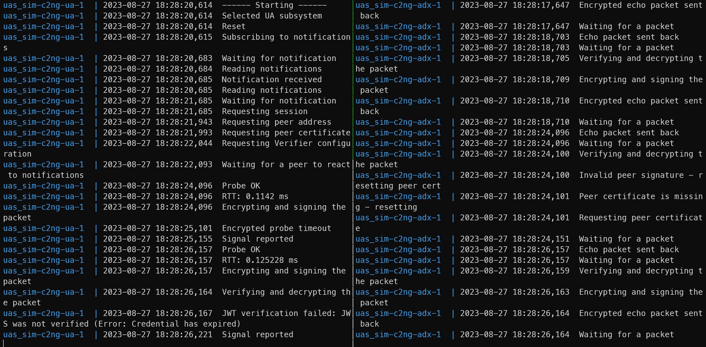

# VI: Verification

This section describes a basic scenario for software testing and demostation. These step shall follow the steps describes in the ["Getting Started"](./START.md#launch-sequence) section.

### Prerequisites

To simplify this procedure, we need to install the following:

* an alias for the `docker-compose` tool;
* `jq` - commandline JSON processor.

For Debian-based Linux, execute:

```sh
alias dc=docker-compose $*
sudo apt-get install jq
```

## Validate Container State

Query application status with:

```sh
dc ps --format json | jq
```

### Output Received During Verification

```json
[
  {
    "ID": "fc35b2c5c5bcca3660693959bd4bc56f780fede927084d749da37005f61ad50b",
    "Name": "c2ng-c2ng-1",
    "Image": "c2ng",
    "Command": "python3 app.py",
    "Project": "c2ng",
    "Service": "c2ng",
    "Created": 1684903964,
    "State": "running",
    "Status": "Up 3 minutes",
    "Health": "",
    "ExitCode": 0,
    "Publishers": [
      {
        "URL": "0.0.0.0",
        "TargetPort": 9090,
        "PublishedPort": 9090,
        "Protocol": "tcp"
      }
    ]
  },
  {
    "ID": "884b7d228562684380a16d0fbac573277ea22b97a1544624892c1f3667463315",
    "Name": "c2ng-influxdb-1",
    "Image": "influxdb",
    "Command": "/entrypoint.sh influxd",
    "Project": "c2ng",
    "Service": "influxdb",
    "Created": 1684903949,
    "State": "running",
    "Status": "Up 3 minutes",
    "Health": "",
    "ExitCode": 0,
    "Publishers": [
      {
        "URL": "0.0.0.0",
        "TargetPort": 8086,
        "PublishedPort": 8086,
        "Protocol": "tcp"
      }
    ]
  },
  {
    "ID": "bd8b84cc70cc3deca6394f60d43ca15ddeecf8329d344ad56947b6e76740df7d",
    "Name": "c2ng-mongo-1",
    "Image": "mongo",
    "Command": "docker-entrypoint.sh mongod",
    "Project": "c2ng",
    "Service": "mongo",
    "Created": 1684903950,
    "State": "running",
    "Status": "Up 3 minutes",
    "Health": "",
    "ExitCode": 0,
    "Publishers": [
      {
        "URL": "0.0.0.0",
        "TargetPort": 27017,
        "PublishedPort": 27017,
        "Protocol": "tcp"
      }
    ]
  },
  {
    "ID": "460516f2dd9ad8bc028662835c7e0314ee8ae1511550342ac04a8e40a7232e4a",
    "Name": "c2ng-mongo-express-1",
    "Image": "mongo-express",
    "Command": "tini -- /docker-entrypoint.sh mongo-express",
    "Project": "c2ng",
    "Service": "mongo-express",
    "Created": 1684903955,
    "State": "running",
    "Status": "Up 3 minutes",
    "Health": "",
    "ExitCode": 0,
    "Publishers": [
      {
        "URL": "0.0.0.0",
        "TargetPort": 8081,
        "PublishedPort": 8081,
        "Protocol": "tcp"
      }
    ]
  },
  {
    "ID": "9f890fcab6389895cd9a4d7303a1055324d140e6fb1feefb54ff760c73293e43",
    "Name": "c2ng-oauth-1",
    "Image": "quay.io/keycloak/keycloak",
    "Command": "/opt/keycloak/bin/kc.sh start-dev",
    "Project": "c2ng",
    "Service": "oauth",
    "Created": 1684903950,
    "State": "running",
    "Status": "Up 3 minutes",
    "Health": "",
    "ExitCode": 0,
    "Publishers": [
      {
        "URL": "0.0.0.0",
        "TargetPort": 8080,
        "PublishedPort": 8080,
        "Protocol": "tcp"
      },
      {
        "URL": "",
        "TargetPort": 8443,
        "PublishedPort": 0,
        "Protocol": "tcp"
      }
    ]
  }
]
```

## Check Service Startup

Execute:

```sh
dc logs c2ng -f
```

The service should show that it's private and public key are successfully loaded:


## USSP Simulation

Run the USSP Flight Authrization Endpoint Simulator with

```sh
python tools/c2ng.py uss
```

### Captured Output


## ADX User Simulation

Run the Remote Pilot Station Simulator with:

```sh
python tools/c2ng.py adx
```

The simulator shall receive a session from the service and start polling for the peer's (UA) certificate.

### Captured Output

ADX Simulator output:


Service output:


USS Simulator Output:


## UA User Simulation

Run the UA (drone) Simulator with:

```sh
python tools/c2ng.py ua
```

### Captured Output

Side-by-side data exchange between the simulators:



The session data is stored in the data base as shown on the following MongoExpress tool screenshot:


Simultaneously, the UA simulator send the emulated signal data to the service, as reflected in the service logs:


